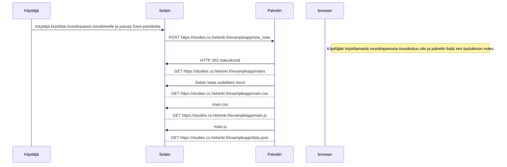

# Osa 0 vastaukset

# 0.4: uusi muistiinpano

```mermaid

sequenceDiagram
    participant Käyttäjä
    participant Selain
    participant Palvelin
    Käyttäjä->>Selain: Käyttäjä kirjoittaa muistiinpanon lomakkeelle ja painaa Save-painiketta
    
    Selain->>Palvelin: POST https://studies.cs.helsinki.fi/exampleapp/new_note
    Note right of browser: Käyttäjän kirjoittamasta muistiinpanosta muodostuu olio ja palvelin lisää sen taulukkoon notes
    Palvelin->>Selain: HTTP 302-statuskoodi
    Selain-->Palvelin: GET https://studies.cs.helsinki.fi/exampleapp/notes
    Palvelin->>Selain: Selain lataa uudelleen sivun
    Selain-->Palvelin: GET https://studies.cs.helsinki.fi/exampleapp/main.css
    Palvelin->>Selain: main.css
    Selain-->Palvelin: GET https://studies.cs.helsinki.fi/exampleapp/main.js
    Palvelin->>Selain: main.js
    Selain-->Palvelin: GET https://studies.cs.helsinki.fi/exampleapp/data.json
    


   
    
```
